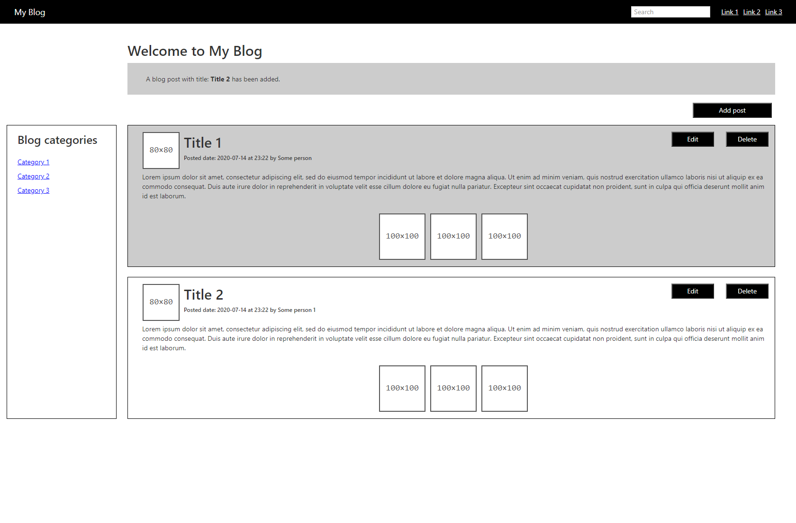

# Blog app
> React application created for adding, fetching, listing, deleting, updating and searching posts with REST API

See a Demo on [BLOG-APP].

This project was bootstrapped with [Create React App](https://github.com/facebook/create-react-app).

## Table of contents
* [Screenshots](#screenshots)
* [Technologies](#technologies)
* [Available-Scripts](#available-pscripts)
* [Features](#features)
* [Contact](#contact)

## Screenshots

## Technologies
* [React] - [version 16.13.1]
* [React-dom] - [version 16.13.1]
* [React-redux] - [version 7.2.0]
* [Redux] - [version 4.0.5]
* [Redux-thunk] - [version 2.3.0]
* [Axios] - [version 0.19.0]
* [Clsx] - [version 1.1.1]
* [Node-sass] - [version 4.14.1]

## Available-Scripts

In the project directory, you can run:

### `yarn dev`

Runs the app in the development mode. 
Open [http://localhost:3000](http://localhost:3000) to view it in the browser.

The page will reload if you make edits. 
You will also see any lint errors in the console.

### `yarn build`

Builds the app for production to the `build` folder. 
It correctly bundles React in production mode and optimizes the build for the best performance.

The build is minified and the filenames include the hashes. 
Your app is ready to be deployed!

See the section about [deployment](https://facebook.github.io/create-react-app/docs/deployment) for more information.

## Features

* Post fetching
* Post listing
* Post adding
* Post deleting
* Post updating
* Post searching

## Contact
Created by [Vladimir Karatosic] - feel free to contact me!

You can visit my [GitHub] page and see the rest of my projects.
If you like it, give me the Star. Thanks!

[BLOG-APP]:https://blog-app-vladimir.herokuapp.com/
[Vladimir Karatosic]:http://vladimirkaratosic.com
[GitHub]:https://github.com/VladimirKaratosic